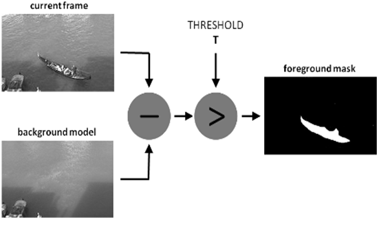

# Motion-detection

**Motion-Detection** – the program video surveillance. It take an image from camera (computer camera or IP-camera)  and cheks the image for detection movements.<br/> 
If the movement was detected this program sends an email about detected movement to a user or several users.

## Structure
___

+ folder `images` - saves all previous images with detected movement.
+ folder `sources` - includes file `receiver.csv` with info about receivers.
+ `config.py` - includes all constants.
+ `cam_functions.py` - include all functions for work with camera.
+ `sender.py` - includes functions for work with .csv-files (writing and reading).
+ `main.py` - the core of project and main file.

## Working with image
___
> **Background substraction** - makes a mask of image front performing substraction with the current frame and the background model.
<br/>


<br/><br/>

> **Image smoothing** - image smothing by Gaussian filters.

```python
     # blur image
     blur = cv2.GaussianBlur(frame, (21, 21), 0)
     fgmask = fgbg.apply(blur)

```

<br/>


<br/><br/>

> **Cleaning noises** 
```python 
fgmask2 = cv2.morphologyEx(fgmask,cv2.MORPH_OPEN, kernel)
```
<br/>


<br/><br/>

> **Searching any white contours on the black template**. Rectangle builds around found objects by function `cv2.rectangle()`.
```python
cnts =  cv2.findContours(thresh.copy(), cv2.RETR_TREE, cv2.CHAIN_APPROX_SIMPLE)[0]
            (x,y,w,h) = cv2.boundingRect(item)

       # paint contour as rectangle around
        for item in cnts:
            if cv2.contourArea(item) < 3000:
                continue
            
            detect_status = True

            # paint rectangle
            cv2.rectangle(frame, (x,y), (x+w, y+h), (255, 255, 0), 3)
```


<br/><br/>

## Message 
___
A message consist of the text about detected movement and an image with object which one have caused movement.

```python
MESSAGE = """\
MOVE DETECTED

Hi, {name}!\n Detector has fixed any move in your location. Check it!
"""
```
<br/>


<br/><br/>

## Exceptions
___
Errors are being processed If there isn't Internet or camera doesn't work correctly. Also user may close this program if he is wanting.

<br/>


<br/>


